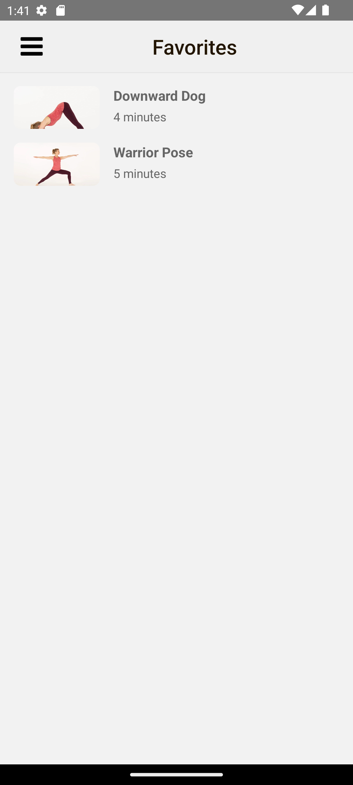
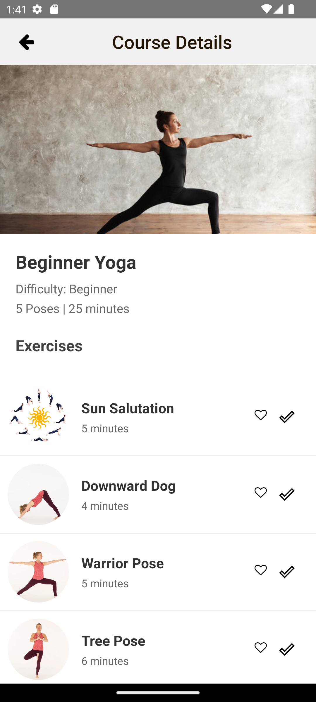
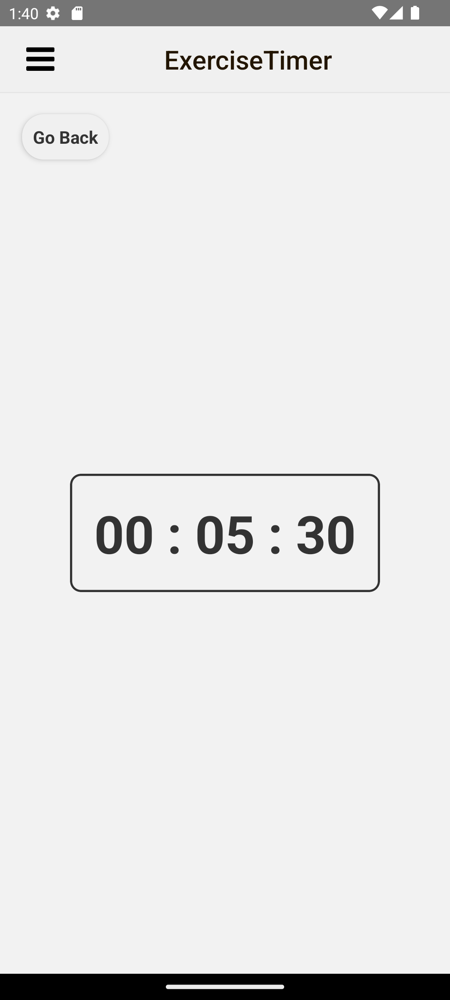

# 🏋️ Cross-Platform Fitness Mobile App

A modern cross-platform fitness application built using **React Native** and **TypeScript**, designed to help users explore workout programs, track exercise completion, manage favorites, and follow guided fitness routines through a clean and intuitive mobile experience.

---

## 📱 Project Overview

This project was developed as a collaborative mobile application focused on creating an engaging and user-friendly fitness experience across both Android and iOS platforms.

The application allows users to:

- Create and manage accounts
- Browse workout programs
- Filter workouts by difficulty and duration
- View detailed exercise pages
- Favorite exercises
- Track workout completion
- Navigate seamlessly through multiple fitness flows

The app was built with a component-based architecture to ensure scalability, maintainability, and consistent UI behavior across platforms.

---

## ✨ Features

### 🔐 Authentication
- User sign up & login
- Input validation for invalid credentials
- Persistent login experience

### 🏋️ Workout Experience
- Exercise browsing
- Beginner, intermediate, and advanced workout filtering
- Duration-based filtering
- Detailed exercise pages
- Exercise completion tracking
- Workout finished summary page

### ❤️ Favorites System
- Save favorite exercises
- Dedicated favorites page
- Quick access through hamburger navigation

### ⏱️ Fitness Utilities
- Built-in workout timer
- Dynamic filtering system
- Smooth screen navigation
- Responsive mobile UI

### 💾 Data Management
- SQLite local database integration
- Persistent user and workout data storage
- Scalable data handling architecture

---

## 🛠️ Tech Stack

| Technology | Purpose |
|------------|---------|
| React Native | Cross-platform mobile development |
| TypeScript | Type-safe application development |
| SQLite | Local mobile database |
| Node.js | Backend services |
| REST APIs | Data communication |
| React Navigation | Mobile navigation system |

## 📸 Screenshots

## 📸 Screenshots

## 📸 Screenshots

| Login Screen | Sign Up Screen |
|---|---|
|  |  |

| Home Screen | Workout Filters |
|---|---|
|  |  |

| Beginner Yoga Course | Favorites Page |
|---|---|
|  |  |
